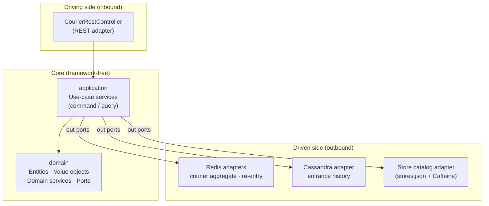
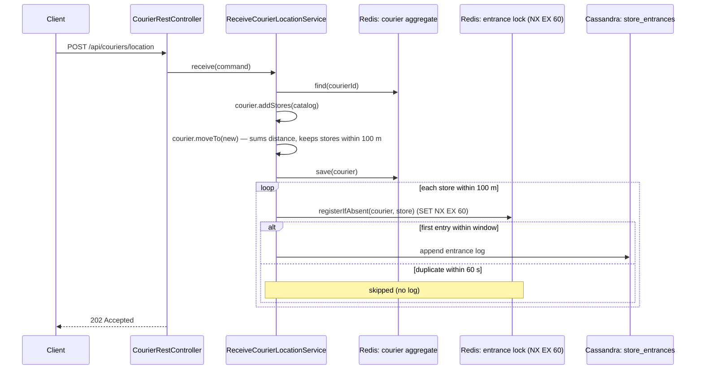

# Courier Tracking Service

A backend service that ingests **real‑time GPS location updates** from couriers, calculates how far each courier has travelled, and detects when a courier **enters the circumference of a Migros store**.

It is built with **Java 21 + Spring Boot 3.5**, organised as a **Hexagonal (Ports & Adapters) multi‑module Maven project**, and backed by **Redis** (hot state: the courier aggregate — total distance & last position — plus re‑entry de‑duplication) and **Cassandra** (durable store‑entrance history).

---

## Table of Contents

1. [What this service does](#what-this-service-does)
2. [Business rules](#business-rules)
3. [Architecture](#architecture)
4. [Technology stack](#technology-stack)
5. [Project structure](#project-structure)
6. [Prerequisites](#prerequisites)
7. [Quick start (Docker Compose)](#quick-start-docker-compose)
8. [Running locally (for development)](#running-locally-for-development)
9. [Configuration](#configuration)
10. [REST API reference](#rest-api-reference)
11. [OpenAPI specification](#openapi-specification)
12. [End‑to‑end scenario walkthrough](#end-to-end-scenario-walkthrough)
13. [How a location update is processed](#how-a-location-update-is-processed)
14. [Data model](#data-model)
15. [Testing](#testing)
16. [Troubleshooting](#troubleshooting)
17. [Design decisions](#design-decisions)

---

## What this service does

Couriers move around the city and periodically report their GPS position. For every reported position the service:

1. **Accumulates the total distance** the courier has travelled (sum of the straight‑line distance between each consecutive pair of reported points).
2. **Detects store entrances** — whenever a courier comes within **100 metres** of one of the known Migros stores, that visit is recorded.

Two read APIs are exposed on top of this:

- **Total travelled distance** for a courier.
- **The list of store entrances** for a courier.

The known stores are a small, static catalog of five Istanbul Migros branches loaded from [`stores.json`](bootstrap/src/main/resources/stores.json).

---

## Business rules

| # | Rule | Where it lives |
|---|------|----------------|
| 1 | A store **entrance** is detected when the courier is within **100 m** of a store, measured with the **Haversine** great‑circle formula. | [`Courier.moveTo`](domain/src/main/java/com/couriertracking/domain/aggregate/Courier.java) (keeps the stores within `Courier.ENTRANCE_RADIUS`), [`HaversineDistanceCalculator`](domain/src/main/java/com/couriertracking/domain/service/HaversineDistanceCalculator.java) |
| 2 | **Re‑entry de‑duplication:** if a courier enters the *same* store again **within 60 seconds**, it is **not** logged a second time. Leaving and coming back after the window *is* a new entrance. | [`ReceiveCourierLocationService`](application/src/main/java/com/couriertracking/application/command/ReceiveCourierLocationService.java) (gates the entrance write on the lock) via [`StoreEntranceLockRepository`](domain/src/main/java/com/couriertracking/domain/port/out/StoreEntranceLockRepository.java) → [`StoreEntranceLockRepositoryAdapter`](infrastructure/src/main/java/com/couriertracking/infrastructure/adapter/StoreEntranceLockRepositoryAdapter.java) (Redis `SET key value NX EX 60`; the adapter owns the 60 s TTL) |
| 3 | **Total distance** is the running sum of Haversine distances between consecutive reported positions for a courier. The very first position adds **0 m** (there is no previous point to measure from). The total is accumulated **inside the `Courier` aggregate** and persisted with it. | [`Courier.moveTo`](domain/src/main/java/com/couriertracking/domain/aggregate/Courier.java), [`CourierRepositoryAdapter`](infrastructure/src/main/java/com/couriertracking/infrastructure/adapter/CourierRepositoryAdapter.java) |
| 4 | A single reported position may be near **several** stores at once — each qualifying store produces its own (de‑duplicated) entrance. | [`ReceiveCourierLocationService`](application/src/main/java/com/couriertracking/application/command/ReceiveCourierLocationService.java) |
| 5 | `latitude` and `longitude` are **required**; coordinates must be valid (`lat ∈ [-90, 90]`, `lng ∈ [-180, 180]`). `occurredAt` is optional and defaults to the server's current time. | [`CourierRestController`](infrastructure/src/main/java/com/couriertracking/infrastructure/api/CourierRestController.java), [`GeoPoint`](domain/src/main/java/com/couriertracking/domain/valueobject/GeoPoint.java) |

> The 100 m radius (`Courier.ENTRANCE_RADIUS`, in the domain) and the 60 s re‑entry window (`StoreEntranceLockRepositoryAdapter.TTL`, in the Redis adapter) are the two knobs that define entrance behaviour.

---

## Architecture

The project follows **Hexagonal Architecture (Ports & Adapters)** with the dependency rule pointing **inward**: the domain knows nothing about Spring, the web, Redis, or Cassandra. Outer layers depend on inner layers, never the reverse.



**Module dependency direction:** `bootstrap → infrastructure → application → domain`

- **`domain`** — pure business model. Aggregate (`Courier` — accumulates total distance and keeps the stores within the 100 m entrance radius) and entity (`Store`), value objects (`GeoPoint`, `Distance`, `CourierId`, …), domain services (`HaversineDistanceCalculator` behind the `DistanceCalculator` port), and the **ports** (`port.in` use‑case interfaces, `port.out` repository/gateway interfaces). No framework imports.
- **`application`** — orchestrates use cases. Split into **commands** (write side: `ReceiveCourierLocationService`) and **queries** (read side: `GetTotalTravelDistanceService`, `GetStoreEntrancesService`). Depends only on `domain`.
- **`infrastructure`** — the adapters that implement the ports: REST controller + DTOs, Redis adapters, the Cassandra repository, and the `stores.json` loader. Depends on `application`.
- **`bootstrap`** — the Spring Boot application entry point and wiring (`UseCaseConfiguration` builds the framework‑free use‑case beans; `CassandraConfig` sets up the keyspace/schema).

**Read/write separation (light CQRS):** the command path appends each entrance straight to Cassandra through the `StoreEntranceLogRepository` port; the read API ([`GetStoreEntrancesService`](application/src/main/java/com/couriertracking/application/query/GetStoreEntrancesService.java)) queries the same `store_entrances` table.

---

## Technology stack

| Concern | Choice |
|---------|--------|
| Language / runtime | **Java 21** |
| Framework | **Spring Boot 3.5.15** (Web, Data Cassandra, Data Redis) |
| Build | **Maven** (multi‑module reactor) |
| Hot state store | **Redis 7** — courier aggregate (distance + last position), re‑entry window |
| Durable store | **Apache Cassandra 4.1** — store‑entrance history |
| In‑memory cache | **Caffeine** — caches the static store catalog |
| Testing | **JUnit 5**, **Mockito**, **AssertJ**, **Spring MockMvc** |
| Packaging / run | **Docker** + **Docker Compose** |

---

## Project structure

```
courier-tracking/
├── pom.xml                      # Parent reactor POM (Spring Boot parent, modules, dependency mgmt)
├── docker-compose.yml           # cassandra + redis + app
├── Dockerfile                   # multi-stage build of the boot jar
│
├── domain/                      # Pure business core (no framework)
│   └── src/main/java/com/couriertracking/domain/
│       ├── aggregate/Courier.java
│       ├── entity/Store.java
│       ├── valueobject/         # GeoPoint, Distance, CourierId, StoreName, OccurredAt, EntranceLog
│       ├── service/             # DistanceCalculator, HaversineDistanceCalculator
│       └── port/
│           ├── in/              # Use-case interfaces + ReceiveCourierLocationCommand
│           └── out/             # StoreRepository, CourierRepository,
│                                #   StoreEntranceLockRepository, StoreEntranceLogRepository
│
├── application/                 # Use-case orchestration (command/query)
│   └── src/main/java/com/couriertracking/application/
│       ├── command/ReceiveCourierLocationService.java
│       └── query/   GetTotalTravelDistanceService.java, GetStoreEntrancesService.java
│
├── infrastructure/              # Adapters that implement the ports
│   └── src/main/java/com/couriertracking/infrastructure/
│       ├── api/                 # CourierRestController, GlobalExceptionHandler, dto/
│       ├── adapter/             # Redis + store-catalog + entrance-log adapters
│       └── persistence/cassandra/  # EntranceLogEntity, EntranceLogCassandraRepository
│
└── bootstrap/                   # Spring Boot entry point + wiring
    └── src/main/
        ├── java/.../CourierTrackingApplication.java
        ├── java/.../config/     # UseCaseConfiguration, CassandraConfig
        └── resources/           # application.yml, stores.json
```

---

## Prerequisites

To **run everything in containers** (recommended), you only need:

- **Docker** and **Docker Compose**

To **build or develop locally**, you also need:

- **JDK 21** — the project targets Java 21 and will not compile on older JDKs.
  Make sure `JAVA_HOME` points at a 21 JDK:
  ```bash
  java -version        # should report 21.x
  echo $JAVA_HOME      # should point to a JDK 21 install
  ```
- **Maven 3.9+** (the project has no Maven wrapper, so a system Maven is required for local builds).
- A running **Redis** and **Cassandra** (the Compose file can provide these — see below).

---

## Quick start (Docker Compose)

This is the simplest way to get a fully working stack (app + Redis + Cassandra) with no local Java/Maven setup. The app image is built from source inside Docker.

```bash
# From the project root
docker compose up --build
```

What happens:

- **Cassandra** starts on `9042` and **Redis** on `6379`, each with a health check.
- The **app** waits until both are healthy, then starts on **http://localhost:8080**.
- On first boot the app **auto‑creates** the `courier_tracking` keyspace and the `store_entrances` table.

> ⏳ Cassandra can take **30–60 seconds** to become healthy on first start. The app deliberately waits for it via `depends_on: condition: service_healthy`.

Verify it is up:

```bash
curl -i http://localhost:8080/api/couriers/courier-1/total-distance
# => 200 OK  {"courierId":"courier-1","totalDistanceMeters":0.0}
```

Tear everything down (and wipe Cassandra data):

```bash
docker compose down -v
```

---

## Running locally (for development)

Run the **infrastructure** in containers but the **app** from your IDE/Maven — handy for fast iteration.

**1. Start only Redis and Cassandra:**

```bash
docker compose up -d cassandra redis
```

**2. Build the whole project and run the tests:**

```bash
mvn clean verify
```

**3. Run the application:**

```bash
mvn -pl bootstrap spring-boot:run
```

or run the packaged jar:

```bash
mvn clean package
java -jar bootstrap/target/courier-tracking.jar
```

The app connects to Redis/Cassandra on `127.0.0.1` by default (see [Configuration](#configuration)), so no extra environment variables are needed when the containers expose the default ports.

---

## Configuration

All settings live in [`bootstrap/src/main/resources/application.yml`](bootstrap/src/main/resources/application.yml) and can be overridden with environment variables. Defaults are tuned for **local** use; `docker-compose.yml` overrides the hosts for the **container network**.

| Environment variable | Default | Description |
|----------------------|---------|-------------|
| `CASSANDRA_CONTACT_POINTS` | `127.0.0.1` | Cassandra host(s). Compose sets this to `cassandra`. |
| `CASSANDRA_PORT` | `9042` | Cassandra CQL port. |
| `CASSANDRA_LOCAL_DATACENTER` | `datacenter1` | Cassandra local DC name. |
| `REDIS_HOST` | `127.0.0.1` | Redis host. Compose sets this to `redis`. |
| `REDIS_PORT` | `6379` | Redis port. |

Other fixed settings (in `application.yml`):

- `server.port: 8080` — HTTP port.
- `spring.cassandra.keyspace-name: courier_tracking` — keyspace (auto‑created, `SimpleStrategy` RF 1).
- `courier-tracking.stores-resource: classpath:stores.json` — source of the store catalog. Point this at an external file (e.g. `file:/data/stores.json`) to supply your own stores.

---

## REST API reference

Base URL: `http://localhost:8080`

### 1. Report a courier location

```
POST /api/couriers/location
Content-Type: application/json
```

**Request body**

| Field | Type | Required | Notes |
|-------|------|----------|-------|
| `courierId` | string | yes | Identifies the courier. |
| `latitude` | number | **yes** | `[-90, 90]`. |
| `longitude` | number | **yes** | `[-180, 180]`. |
| `occurredAt` | string (ISO‑8601 instant) | no | e.g. `2026-06-20T10:15:30Z`. Defaults to server time. |

**Responses**

- `202 Accepted` — accepted for processing (no body).
- `400 Bad Request` — missing/invalid coordinates, e.g.:
  ```json
  { "error": "bad_request", "message": "latitude and longitude are required" }
  ```

**Example**

```bash
curl -i -X POST http://localhost:8080/api/couriers/location \
  -H "Content-Type: application/json" \
  -d '{"courierId":"courier-1","latitude":40.9923307,"longitude":29.1244229,"occurredAt":"2026-06-20T10:15:30Z"}'
```

### 2. Get total travel distance

```
GET /api/couriers/{courierId}/total-distance
```

**Response** `200 OK`

```json
{ "courierId": "courier-1", "totalDistanceMeters": 1543.27 }
```

An unknown courier returns `0.0` (no error).

```bash
curl http://localhost:8080/api/couriers/courier-1/total-distance
```

### 3. Get store entrances

```
GET /api/couriers/{courierId}/entrances
```

Returns the courier's entrances from the **last 7 days** only (most recent first). The window bounds the Cassandra partition scan so the endpoint stays fast as a courier's history grows.

**Response** `200 OK` — array, most recent first:

```json
[
  {
    "storeName": "Ataşehir MMM Migros",
    "lat": 40.9923307,
    "lng": 29.1244229,
    "occurredAt": "2026-06-20T10:15:30Z"
  }
]
```

An unknown courier returns `[]`.

```bash
curl http://localhost:8080/api/couriers/courier-1/entrances
```

---

## OpenAPI specification

The running application serves **interactive API documentation** generated by [springdoc-openapi](https://springdoc.org/) — no extra setup needed once the app is up:

| Resource | URL |
|----------|-----|
| **Swagger UI** (browse & execute requests) | http://localhost:8080/swagger-ui.html |
| **OpenAPI 3 spec** (JSON) | http://localhost:8080/v3/api-docs |

> 💡 Reviewers: start the stack (`docker compose up --build`), open **http://localhost:8080/swagger-ui.html**, and use **“Try it out”** on each endpoint to call the live service.

The same contract is reproduced below as a static **OpenAPI 3.1** document, so it can be read without running the app. Save it as `openapi.yaml` and open it in any OpenAPI tool — for example the [Swagger Editor](https://editor.swagger.io) — or generate a client with `openapi-generator`.

```yaml
openapi: 3.1.0
info:
  title: Courier Tracking Service API
  description: >-
    Ingests courier GPS locations, accumulates travelled distance, and records
    store entrances when a courier comes within 100 m of a Migros store.
  version: 1.0.0
servers:
  - url: http://localhost:8080
    description: Local instance
paths:
  /api/couriers/location:
    post:
      summary: Report a courier location
      description: >-
        Accepts a GPS position. Updates the courier's total travelled distance
        and records a store entrance for every store within 100 m (de-duplicated
        per store for 60 seconds).
      operationId: receiveCourierLocation
      requestBody:
        required: true
        content:
          application/json:
            schema:
              $ref: '#/components/schemas/LocationRequest'
            examples:
              atStore:
                summary: Courier exactly at Ataşehir MMM Migros
                value:
                  courierId: courier-1
                  latitude: 40.9923307
                  longitude: 29.1244229
                  occurredAt: '2026-06-20T10:15:30Z'
      responses:
        '202':
          description: Accepted for processing (no body).
        '400':
          description: Missing or invalid coordinates.
          content:
            application/json:
              schema:
                $ref: '#/components/schemas/ErrorResponse'
              example:
                error: bad_request
                message: latitude and longitude are required
  /api/couriers/{courierId}/total-distance:
    get:
      summary: Get total travel distance
      description: Returns the courier's accumulated distance in metres (0.0 if unknown).
      operationId: getTotalTravelDistance
      parameters:
        - $ref: '#/components/parameters/CourierId'
      responses:
        '200':
          description: The courier's total travelled distance.
          content:
            application/json:
              schema:
                $ref: '#/components/schemas/TotalDistanceResponse'
              example:
                courierId: courier-1
                totalDistanceMeters: 1543.27
  /api/couriers/{courierId}/entrances:
    get:
      summary: Get store entrances
      description: >-
        Returns the courier's store entrances from the last 7 days, most recent first (empty if
        unknown). The time window bounds the Cassandra partition scan.
      operationId: getStoreEntrances
      parameters:
        - $ref: '#/components/parameters/CourierId'
      responses:
        '200':
          description: The courier's store entrances.
          content:
            application/json:
              schema:
                type: array
                items:
                  $ref: '#/components/schemas/EntranceResponse'
              example:
                - storeName: Ataşehir MMM Migros
                  lat: 40.9923307
                  lng: 29.1244229
                  occurredAt: '2026-06-20T10:15:30Z'
components:
  parameters:
    CourierId:
      name: courierId
      in: path
      required: true
      description: Identifies the courier.
      schema:
        type: string
        example: courier-1
  schemas:
    LocationRequest:
      type: object
      required: [latitude, longitude]
      properties:
        courierId:
          type: string
          example: courier-1
        latitude:
          type: number
          format: double
          minimum: -90
          maximum: 90
          example: 40.9923307
        longitude:
          type: number
          format: double
          minimum: -180
          maximum: 180
          example: 29.1244229
        occurredAt:
          type: string
          format: date-time
          description: ISO-8601 instant. Optional; defaults to server time.
          example: '2026-06-20T10:15:30Z'
    TotalDistanceResponse:
      type: object
      properties:
        courierId:
          type: string
          example: courier-1
        totalDistanceMeters:
          type: number
          format: double
          example: 1543.27
    EntranceResponse:
      type: object
      properties:
        storeName:
          type: string
          example: Ataşehir MMM Migros
        lat:
          type: number
          format: double
          example: 40.9923307
        lng:
          type: number
          format: double
          example: 29.1244229
        occurredAt:
          type: string
          format: date-time
          example: '2026-06-20T10:15:30Z'
    ErrorResponse:
      type: object
      properties:
        error:
          type: string
          example: bad_request
        message:
          type: string
          example: latitude and longitude are required
```

> This static copy is kept in sync by hand with the live `/v3/api-docs` output; the live spec is always the source of truth.

---

## End‑to‑end scenario walkthrough

This sequence exercises every business rule against the seeded stores. It assumes the stack is running (`docker compose up --build`).

The store **"Ataşehir MMM Migros"** is at `40.9923307, 29.1244229`.

**Step 1 — First location, exactly at the store.** Adds 0 m distance (no previous point) and records one entrance.

```bash
curl -X POST http://localhost:8080/api/couriers/location \
  -H "Content-Type: application/json" \
  -d '{"courierId":"courier-1","latitude":40.9923307,"longitude":29.1244229,"occurredAt":"2026-06-20T10:00:00Z"}'
```

**Step 2 — Move ~50 m away, still within 100 m, within 60 s.** Distance grows, but the entrance is **de‑duplicated** (Rule 2) → still only one entrance.

```bash
curl -X POST http://localhost:8080/api/couriers/location \
  -H "Content-Type: application/json" \
  -d '{"courierId":"courier-1","latitude":40.9927800,"longitude":29.1244229,"occurredAt":"2026-06-20T10:00:30Z"}'
```

**Step 3 — Move far away (no store nearby).** Distance grows; no new entrance.

```bash
curl -X POST http://localhost:8080/api/couriers/location \
  -H "Content-Type: application/json" \
  -d '{"courierId":"courier-1","latitude":41.0500000,"longitude":29.0200000,"occurredAt":"2026-06-20T10:05:00Z"}'
```

**Step 4 — Check the results.**

```bash
curl http://localhost:8080/api/couriers/courier-1/total-distance   # > 0 metres
curl http://localhost:8080/api/couriers/courier-1/entrances        # exactly ONE Ataşehir entrance
```

**Other scenarios to try**

- **Re‑entry after the window:** repeat Step 1 with a later `occurredAt` and after waiting **more than 60 s** in real time (the Redis de‑dup key expires in real time) → a **second** entrance is recorded.
- **Missing coordinates:** `POST` a body without `latitude` → `400 Bad Request` with the error envelope.
- **Multiple couriers:** use a different `courierId`; state (distance, entrances) is fully isolated per courier.

---

## How a location update is processed



---

## Data model

### Redis (hot state, key per courier)

| Key pattern | Type | Written by | Meaning |
|-------------|------|-----------|---------|
| `courier:{id}` | string (JSON) | `CourierRepositoryAdapter` | The whole courier aggregate, serialized as one value: running total distance in metres plus the last reported position. |
| `entrance:{id}:{storeName}` | string, **TTL 60 s** | `StoreEntranceLockRepositoryAdapter` | Re‑entry de‑dup marker (`SET NX EX 60`; the adapter owns the 60 s TTL). |

### Cassandra (durable history)

Table `store_entrances` in keyspace `courier_tracking` (auto‑created on startup):

| Column | Kind | Notes |
|--------|------|-------|
| `courier_id` | partition key | All of a courier's entrances live together. |
| `occurred_at` | clustering (DESC) | Newest first — drives the API ordering. |
| `store_name` | clustering (ASC) | Tie‑break within the same instant. |
| `latitude`, `longitude` | columns | Where the entrance happened. |

---

## Testing

The project ships with unit and integration tests across every layer.

Run the full suite (build + test) from the root:

```bash
mvn clean verify
```

Run the tests for a single module:

```bash
mvn -pl domain test            # domain model & services
mvn -pl application test       # use-case orchestration (Mockito)
mvn -pl infrastructure test    # adapters + REST layer
```

> ⚠️ Tests compile and run on **JDK 21**. If `mvn test` fails with *"release version 21 not supported"*, your `JAVA_HOME` is pointing at an older JDK — switch it to a 21 install.

**What is covered**

| Layer | Tests | Focus |
|-------|-------|-------|
| Domain | `GeoPointTest`, `DistanceTest`, `CourierIdTest`, `StoreNameTest`, `OccurredAtTest`, `EntranceLogTest`, `CourierTest`, `HaversineDistanceCalculatorTest` | Value‑object validation, Haversine accuracy, 100 m store filtering, distance accumulation. |
| Application | `ReceiveCourierLocationServiceTest` | The write‑path orchestration with all ports mocked (distance increment, save, entrance append, de‑dup branch). |
| Infrastructure | `StoreRepositoryAdapterTest`, `CourierRestControllerTest`, `GlobalExceptionHandlerTest` | Store‑catalog loading, REST endpoints via MockMvc (202 / 400 / read APIs), error mapping. |

The REST integration tests use Spring **MockMvc** with mocked use cases — they need **no** running Redis or Cassandra.

---

## Troubleshooting

| Symptom | Cause / fix |
|---------|-------------|
| `mvn` fails: *release version 21 not supported* | `JAVA_HOME` points to an older JDK. Point it at a **JDK 21** install. |
| App exits at startup with a Cassandra connection error | Cassandra not ready yet. With Compose it waits for health; running standalone, start Cassandra first and retry. First boot can take 30–60 s. |
| `total-distance` always returns `0.0` | No locations posted for that `courierId`, or Redis is unreachable. Check `REDIS_HOST`/`REDIS_PORT`. |
| Entrances list is empty after posting near a store | You may be **>100 m** away, or hitting the **60 s** de‑dup window, or Cassandra is unreachable. Verify coordinates and check app logs. |
| Port `8080`/`9042`/`6379` already in use | Stop the conflicting process or change the published ports in `docker-compose.yml`. |

---

## Design decisions

- **Hexagonal + module isolation.** The `domain` and `application` modules have **zero** framework dependencies, so business logic is unit‑testable in milliseconds and the database/web technology can change without touching the core.
- **Redis for hot, mutating state.** The courier aggregate (total distance + last position) is high‑frequency, last‑write‑wins data — a perfect fit for Redis. It is stored as a **single value per courier** (`courier:{id}`), the serialized aggregate, so its invariants are persisted as one unit rather than scattered across keys; the application service just does *load → `moveTo` → save*. (Per‑courier updates are effectively sequential; if strictly atomic accumulation under concurrent writes for the same courier is ever needed, the adapter can move to `WATCH/MULTI` or a Lua script without changing the `CourierRepository` port.) The 60 s re‑entry rule is implemented as an atomic `SET key value NX EX 60`, which doubles as both the de‑dup marker and its own expiry.
- **Cassandra for an append‑only history.** Store entrances are write‑heavy, time‑ordered, and queried by courier — modelled as a partition per courier with `occurred_at DESC` clustering so the read API gets newest‑first ordering for free.
- **Bounded entrance reads (last 7 days).** Cassandra has no offset pagination, so instead of fetching a courier's whole (ever‑growing) partition, `/entrances` issues a clustering‑column slice — `WHERE courier_id = ? AND occurred_at >= now − 7d` — which reads only the recent rows, needs no `ALLOW FILTERING`, and returns newest‑first for free. The window lives in `GetStoreEntrancesService.LOOKBACK`.
- **Direct entrance-log write.** The command path appends each entrance straight to Cassandra through the `StoreEntranceLogRepository` port, gated by the Redis re‑entry lock — keeping the write use case's persistence in one place.
- **Static store catalog cached in Caffeine.** The five stores rarely change, so they are loaded once from `stores.json` and cached in memory rather than hitting a database on every location update.
